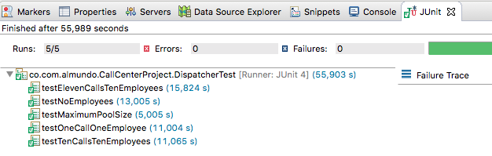
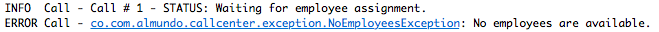
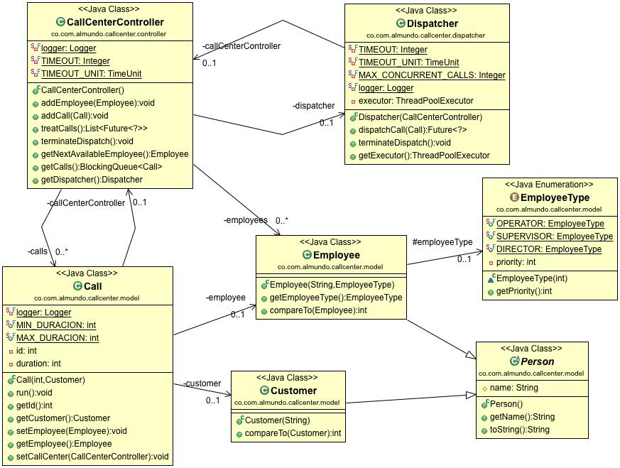

Ejercicio de Java:
-----------------

El objetivo de este ejercicio es conocer cómo los candidatos a entrar a
almundo.com usan herramientas básicas de Java y diseñan soluciones
orientadas a objetos.

Consigna:
---------

Existe un call center donde hay 3 tipos de empleados: operador, supervisor
y director. El proceso de la atención de una llamada telefónica en primera
instancia debe ser atendida por un operador, si no hay ninguno libre debe
ser atendida por un supervisor, y de no haber tampoco supervisores libres
debe ser atendida por un director.

Solución:
---------

Para dar solución al problema propuesto se contemplaron las siguientes implementaciones:

- Se crean todas las clases asociadas al modelo de negocio (Call, Customer, Employee, EmployeeType, Person).
- Se crea el controlador CallCenterController para centralizar todo el funcionamiento asociado al problema, en el se pueden ver los empleados disponibles y las llamadas a procesar.
- Tal como se menciona en el enunciado se crea la clase Dispatcher, que se encarga de lanzar los hilos correspondientes a las llamadas y de controlar la cantidad permitida simultaneamente.
- Cuando se lanzan los hilos haciendo uso de ThreadPoolExecutor se procede a verificar la disponibilidad de los empleados y la prioridad establecidad.
- Se hace uso de varias utilidades dentro de java.util.concurrent.* tales como manejo de colas, pool de hilos, y algunas estructuras de datos tales como LinkedBlockingQueue (cola de llamadas) y PriorityBlockingQueue (cola de empleados priorizados).
- Se crean las pruebas unitarias necesarias.

- Cuando hay llamadas en cola, estas esperan cierto tiempo para ser atendidas y ver si algún empleado se libera, en llegado caso de que no, se lanza la siguiente excepción:

A continuación se muestra diagrama de clases:

Consideraciones:
----------------

- Proyecto creado con Maven.
- JDK 8
- JUnit 4
- ObjectAid para generar diagramas UMLs en Eclipse.